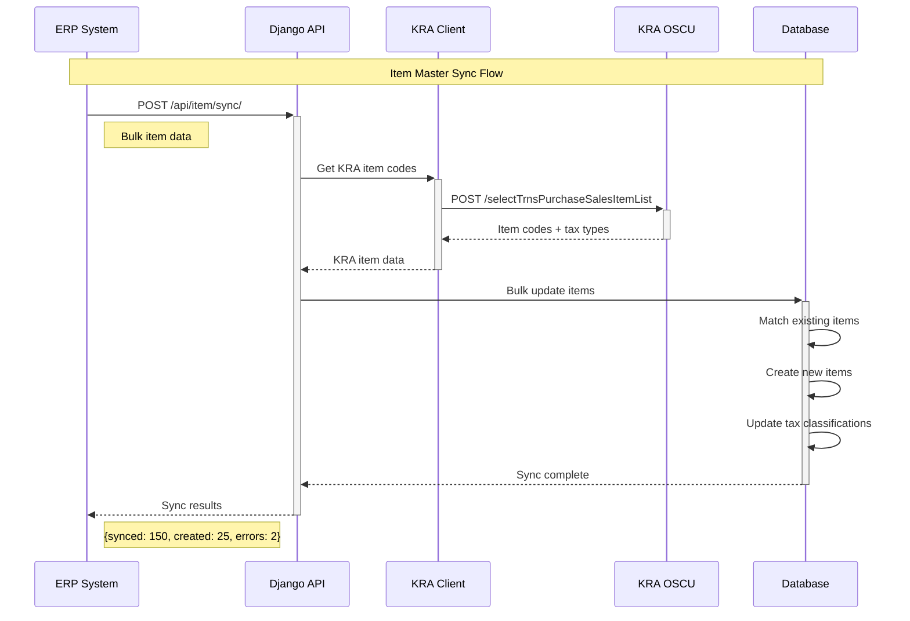
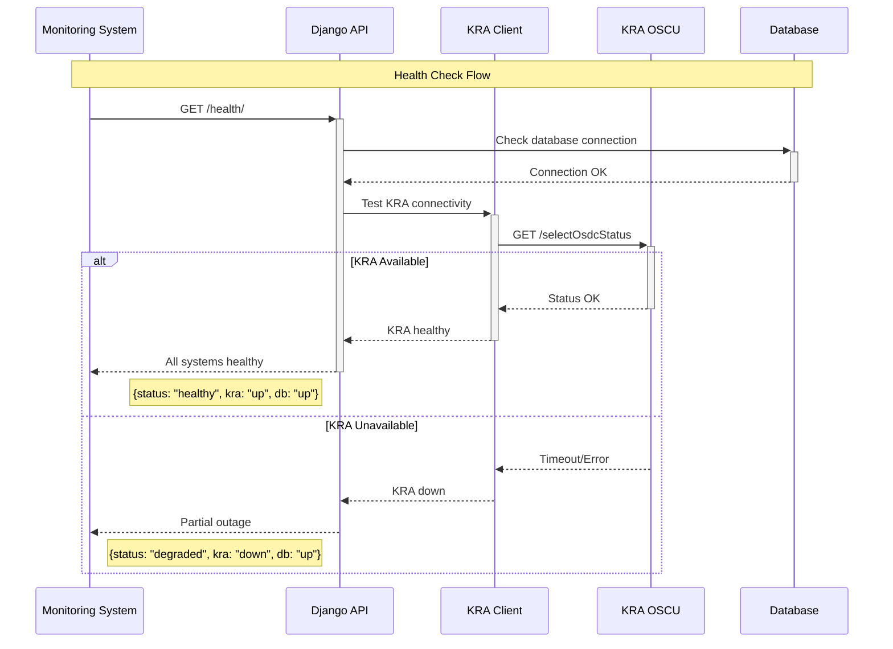
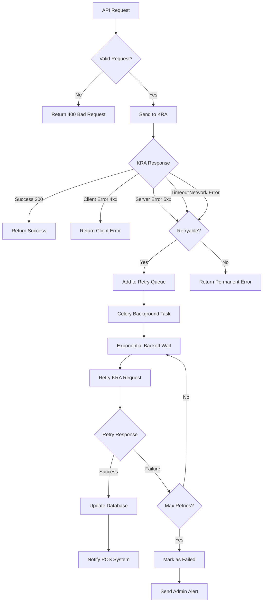
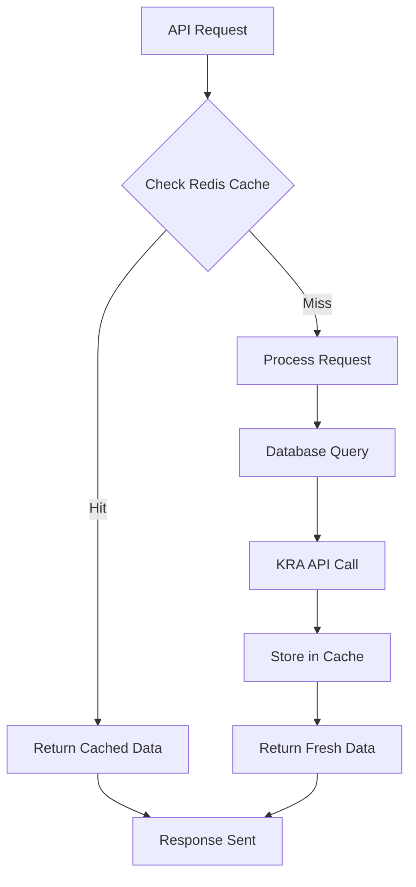

# API Flow Diagrams - eTIMS OSCU Integration

## Complete System Flow Overview

```mermaid
graph TD
    subgraph "POS/ERP Systems"
        POS[Point of Sale System]
        ERP[Enterprise Resource Planning]
    end

    subgraph "Django eTIMS Middleware API"
        DEVICE_INIT[POST /api/device/init/]
        SALES_API[POST /api/sales/]
        ITEM_SYNC[POST /api/item/]
        STATUS_CHECK[GET /api/device/status/]
        HEALTH[GET /health/]
    end

    subgraph "Internal Processing"
        VALIDATOR[Request Validator]
        PAYLOAD_BUILDER[KRA Payload Builder]
        KRA_CLIENT[KRA HTTP Client]
        DB_LAYER[Database Layer]
        CELERY_TASKS[Async Task Queue]
    end

    subgraph "KRA eTIMS OSCU"
        INIT_ENDPOINT[/selectInitOsdcInfo]
        SALES_ENDPOINT[/saveTrnsSalesOsdc]
        CODES_ENDPOINT[/selectTrnsPurchaseSalesItemList]
        STATUS_ENDPOINT[/selectOsdcStatus]
    end

    %% Flow connections
    POS --> DEVICE_INIT
    POS --> SALES_API
    ERP --> ITEM_SYNC

    DEVICE_INIT --> VALIDATOR
    SALES_API --> VALIDATOR
    ITEM_SYNC --> VALIDATOR

    VALIDATOR --> PAYLOAD_BUILDER
    PAYLOAD_BUILDER --> KRA_CLIENT
    KRA_CLIENT --> DB_LAYER

    KRA_CLIENT --> INIT_ENDPOINT
    KRA_CLIENT --> SALES_ENDPOINT
    KRA_CLIENT --> CODES_ENDPOINT

    SALES_API --> CELERY_TASKS
    CELERY_TASKS --> KRA_CLIENT
```

## Detailed API Interaction Flows

### 1. Device Registration & Initialization

```mermaid
sequenceDiagram
    participant POS as POS System
    participant API as Django API
    participant VAL as Validator
    participant KRA_CLIENT as KRA Client
    participant KRA as KRA OSCU
    participant DB as Database

    Note over POS,DB: Device Registration Flow

    POS->>+API: POST /api/device/init/
    Note right of POS: {tin, bhfId, serialNumber}

    API->>+VAL: Validate request
    VAL->>VAL: Check required fields
    VAL->>VAL: Validate TIN format
    VAL-->>-API: Validation result

    alt Validation Success
        API->>+DB: Create device record
        DB-->>-API: Device created

        API->>+KRA_CLIENT: Initialize device
        KRA_CLIENT->>KRA_CLIENT: Build init payload
        KRA_CLIENT->>+KRA: POST /selectInitOsdcInfo
        Note right of KRA_CLIENT: XML payload with device info

        alt KRA Success
            KRA-->>-KRA_CLIENT: CMC Key + device info
            KRA_CLIENT-->>-API: Success response

            API->>+DB: Update device with CMC key
            DB-->>-API: Updated

            API-->>-POS: Success response
            Note left of API: {deviceId, cmcKey, status}

        else KRA Failure
            KRA-->>KRA_CLIENT: Error response
            KRA_CLIENT-->>API: Error details

            API->>DB: Mark device as failed
            API-->>POS: Error response
            Note left of API: {error, message, retryAfter}
        end

    else Validation Failure
        VAL-->>API: Validation errors
        API-->>-POS: Bad request response
        Note left of API: {errors: [...]}
    end
```

### 2. Sales Transaction Processing

```mermaid
sequenceDiagram
    participant POS as POS System
    participant API as Django API
    participant VAL as Validator
    participant BUILDER as Payload Builder
    participant KRA_CLIENT as KRA Client
    participant KRA as KRA OSCU
    participant DB as Database
    participant CELERY as Celery Worker

    Note over POS,CELERY: Sales Transaction Flow

    POS->>+API: POST /api/sales/
    Note right of POS: Invoice + line items

    API->>+VAL: Validate sales data
    VAL->>VAL: Check device exists
    VAL->>VAL: Validate items & amounts
    VAL->>VAL: Check tax calculations
    VAL-->>-API: Validation result

    alt Validation Success
        API->>+DB: Create invoice + items
        DB-->>-API: Invoice created

        API->>+BUILDER: Build KRA payload
        BUILDER->>BUILDER: Format TrnsSalesSaveWrReq
        BUILDER->>BUILDER: Add device CMC key
        BUILDER->>BUILDER: Calculate signatures
        BUILDER-->>-API: KRA payload ready

        API->>+KRA_CLIENT: Send to KRA
        KRA_CLIENT->>+KRA: POST /saveTrnsSalesOsdc
        Note right of KRA_CLIENT: XML with sales data

        alt KRA Success (Real-time)
            KRA-->>-KRA_CLIENT: Receipt signature
            KRA_CLIENT-->>-API: Success + signature

            API->>+DB: Update invoice with signature
            DB-->>-API: Updated

            API-->>-POS: Signed receipt
            Note left of API: {receiptNo, signature, internalData}

        else KRA Failure (Retryable)
            KRA-->>KRA_CLIENT: Temporary failure
            KRA_CLIENT-->>API: Retry needed

            API->>+CELERY: Queue retry task
            CELERY-->>-API: Task queued

            API-->>POS: Temporary receipt
            Note left of API: {tempReceiptNo, status: "pending"}

            Note over CELERY: Async retry processing
            CELERY->>+KRA_CLIENT: Retry sales request
            KRA_CLIENT->>+KRA: POST /saveTrnsSalesOsdc

            alt Retry Success
                KRA-->>-KRA_CLIENT: Receipt signature
                KRA_CLIENT-->>-CELERY: Success

                CELERY->>+DB: Update invoice
                DB-->>-CELERY: Updated
                Note over CELERY: Send notification to POS

            else Retry Failed
                KRA-->>KRA_CLIENT: Permanent failure
                KRA_CLIENT-->>CELERY: Failed

                CELERY->>DB: Mark as failed
                Note over CELERY: Alert administrators
            end

        else KRA Failure (Permanent)
            KRA-->>KRA_CLIENT: Validation error
            KRA_CLIENT-->>API: Permanent failure

            API->>DB: Mark invoice as failed
            API-->>POS: Error response
            Note left of API: {error, kraMessage}
        end

    else Validation Failure
        VAL-->>API: Validation errors
        API-->>-POS: Bad request
    end
```

### 3. Item Synchronization Flow



### 4. System Health & Status Monitoring



## Error Handling Patterns

### Retry Strategy Flow



## Performance Optimization Flows

### Caching Strategy



<function_calls>
<invoke name="todo_list">
<parameter name="todos">[{"id": "1", "content": "Set up Django project structure with etims_integration project and kra_oscu app", "status": "completed", "priority": "high"}, {"id": "1.5", "content": "Generate ERD and system architecture flow chart", "status": "completed", "priority": "high"}, {"id": "2", "content": "Create core models (Device, Invoice, Item, ApiLog) with PostgreSQL support", "status": "in_progress", "priority": "high"}, {"id": "3", "content": "Implement KRA client service for OSCU API communication", "status": "pending", "priority": "high"}, {"id": "4", "content": "Build Django REST API endpoints for device init and sales", "status": "pending", "priority": "high"}, {"id": "5", "content": "Set up Celery for async task processing and retries", "status": "pending", "priority": "medium"}, {"id": "6", "content": "Create serializers and payload builders for KRA format", "status": "pending", "priority": "high"}, {"id": "7", "content": "Add environment configuration and Docker setup", "status": "pending", "priority": "medium"}, {"id": "8", "content": "Create Postman collection for API testing", "status": "pending", "priority": "medium"}, {"id": "9", "content": "Add health check endpoint and testing utilities", "status": "pending", "priority": "low"}]
