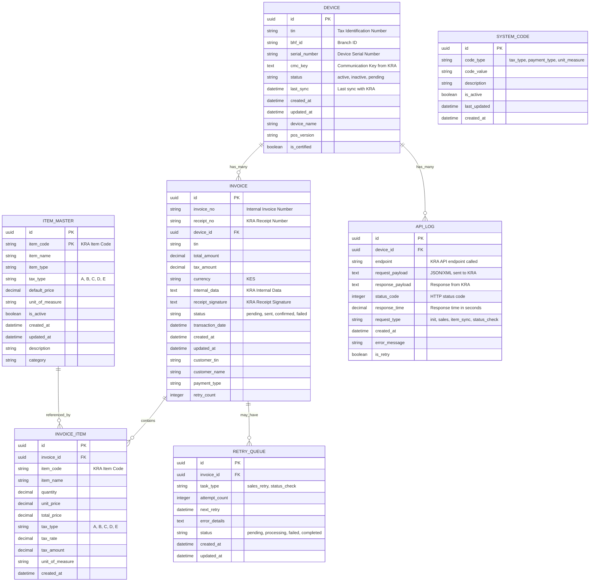

# Entity Relationship Diagram (ERD) - eTIMS OSCU Integration

## Database Schema Overview

## Key Relationships

### 1. Device → Invoice (One-to-Many)
- Each registered device can generate multiple invoices
- Device stores KRA communication key (CMC Key)
- Tracks device certification status

### 2. Invoice → Invoice Items (One-to-Many)
- Each invoice contains multiple line items
- Items reference master item catalog
- Supports different tax types per item

### 3. Invoice → Retry Queue (One-to-One Optional)
- Failed invoices enter retry queue
- Celery tasks process retry attempts
- Exponential backoff strategy

### 4. Device → API Logs (One-to-Many)
- All KRA API calls are logged
- Request/response payloads stored
- Performance monitoring data

## Data Flow Patterns

### Device Registration Flow
1. `DEVICE` record created with basic info
2. KRA API call logged in `API_LOG`
3. CMC Key stored in `DEVICE.cmc_key`
4. Device status updated to 'active'

### Sales Transaction Flow
1. `INVOICE` created with transaction details
2. `INVOICE_ITEM` records created for each line item
3. KRA API call made and logged in `API_LOG`
4. Response signature stored in `INVOICE.receipt_signature`
5. If failed, `RETRY_QUEUE` entry created

### Error Handling Flow
1. Failed transactions logged in `API_LOG`
2. `RETRY_QUEUE` entry created with exponential backoff
3. Celery worker processes retries
4. Final status updated in `INVOICE.status`
