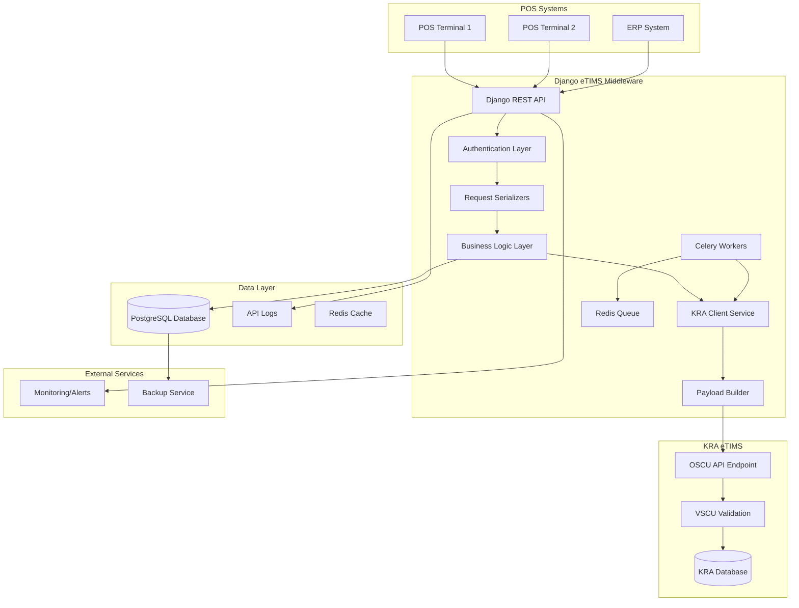
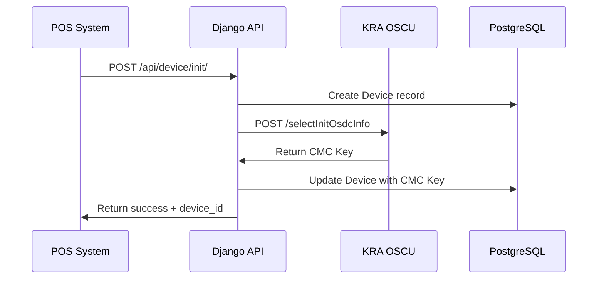
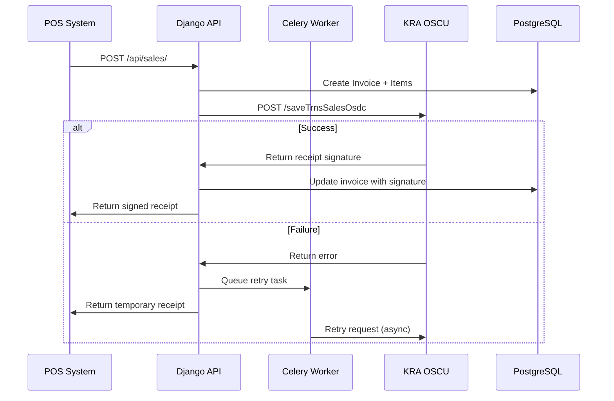
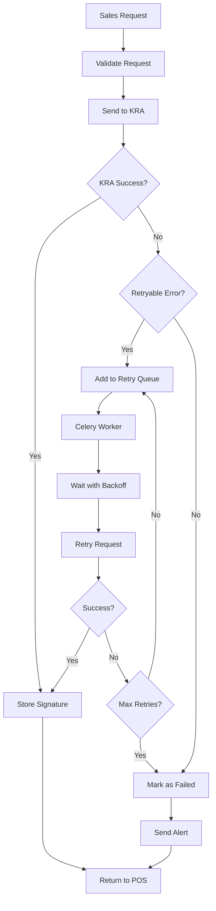
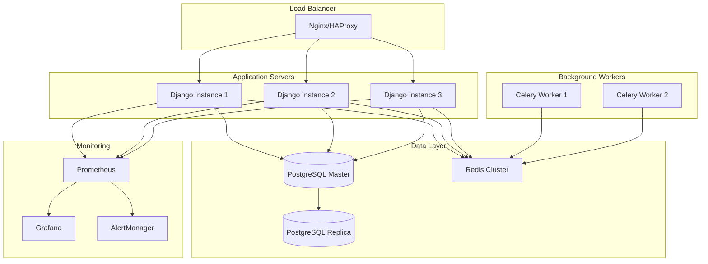

# System Architecture - eTIMS OSCU Integration

## High-Level Architecture

## Component Details

### 1. API Gateway Layer
- **Django REST Framework**: Main API endpoints
- **Authentication**: Token-based auth for POS systems
- **Rate Limiting**: Prevent API abuse
- **CORS**: Cross-origin request handling

### 2. Business Logic Layer
- **Device Management**: Registration and CMC key handling
- **Invoice Processing**: Sales transaction validation
- **Item Management**: Product catalog synchronization
- **Error Handling**: Retry logic and failure management

### 3. KRA Integration Layer
- **KRA Client Service**: HTTP client for OSCU API
- **Payload Builder**: XML/JSON formatting per KRA specs
- **Signature Handling**: Receipt signature processing
- **Connection Management**: Timeout and retry handling

### 4. Async Processing Layer
- **Celery Workers**: Background task processing
- **Redis Queue**: Task queue management
- **Retry Logic**: Exponential backoff for failed requests
- **Monitoring**: Task status tracking

## Data Flow Diagrams

### Device Registration Flow

### Sales Transaction Flow

### Error Handling & Retry Flow

## Security Architecture

### Authentication & Authorization
- **API Keys**: Unique keys per POS system
- **Token Authentication**: JWT tokens for session management
- **IP Whitelisting**: Restrict access by IP ranges
- **Rate Limiting**: Prevent abuse and DoS attacks

### Data Security
- **Encryption at Rest**: Database encryption
- **Encryption in Transit**: HTTPS/TLS for all communications
- **Key Management**: Secure storage of CMC keys
- **Audit Logging**: Complete audit trail of all operations

### KRA Communication Security
- **Certificate Validation**: Verify KRA SSL certificates
- **Request Signing**: Digital signatures for critical requests
- **Timeout Management**: Prevent hanging connections
- **Error Sanitization**: Clean error messages for logs

## Scalability Considerations

### Horizontal Scaling
- **Load Balancer**: Distribute requests across multiple Django instances
- **Database Sharding**: Partition data by device/branch
- **Redis Clustering**: Scale queue processing
- **CDN Integration**: Cache static content

### Performance Optimization
- **Database Indexing**: Optimize query performance
- **Connection Pooling**: Efficient database connections
- **Caching Strategy**: Redis for frequently accessed data
- **Async Processing**: Non-blocking operations

### Monitoring & Observability
- **Health Checks**: System status monitoring
- **Metrics Collection**: Performance and business metrics
- **Log Aggregation**: Centralized logging
- **Alerting**: Real-time error notifications

## Deployment Architecture

### Production Environment

## Integration Patterns

### Synchronous Operations
- Device registration
- Real-time sales validation
- Status checks
- Health monitoring

### Asynchronous Operations
- Failed transaction retries
- Bulk data synchronization
- Report generation
- System maintenance tasks

### Event-Driven Architecture
- Transaction events
- Device status changes
- Error notifications
- Audit trail updates
